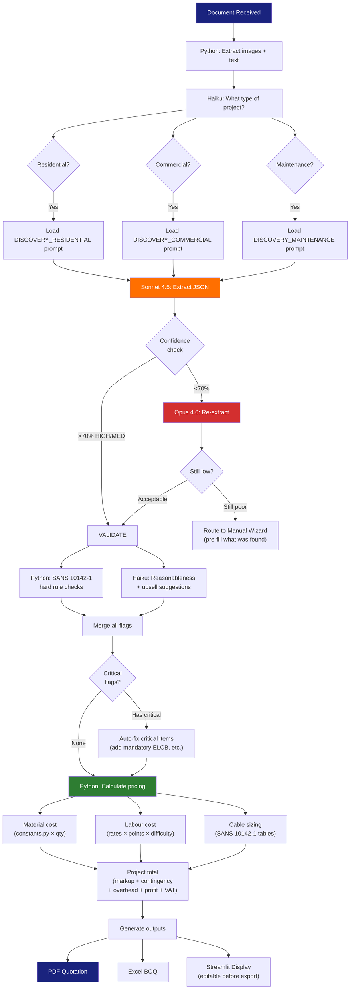
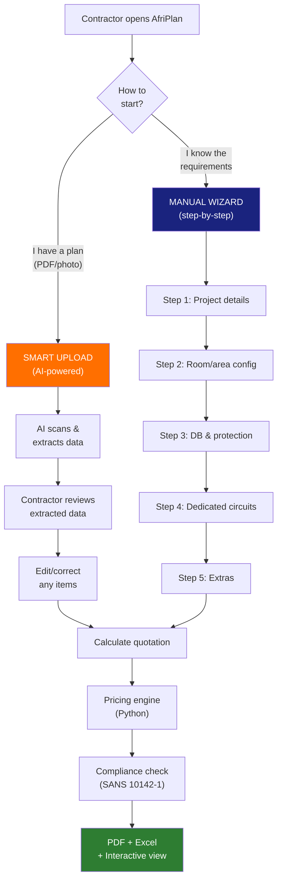

# AfriPlan Electrical — AI Agent Architecture v3.0

> **The Intelligence Layer: Claude API as the Brain of AfriPlan**
>
> This document defines how Claude API orchestrates the entire quotation pipeline — from scanning a building plan to delivering a SANS 10142-1 compliant quotation. Claude reads, interprets, and coordinates. Python calculates.
>
> **Author**: Jonathan Lukwichi — JLWanalytics
> **Version**: 3.0 — February 2026
> **Scope**: Residential · Commercial · Maintenance & Repair
> **Note**: Load shedding is no longer an active issue in SA — removed from scope

---

## TABLE OF CONTENTS

1. [Platform Scope & Service Tiers](#1-platform-scope--service-tiers)
2. [AI Agent Philosophy](#2-ai-agent-philosophy)
3. [System Architecture Overview](#3-system-architecture-overview)
4. [The 6-Stage AI Pipeline](#4-the-6-stage-ai-pipeline)
5. [Stage 1: INGEST — Document Processing](#5-stage-1-ingest)
6. [Stage 2: CLASSIFY — Project Routing](#6-stage-2-classify)
7. [Stage 3: DISCOVER — Intelligent Extraction](#7-stage-3-discover)
8. [Stage 4: VALIDATE — Compliance Engine](#8-stage-4-validate)
9. [Stage 5: PRICE — Deterministic Calculation](#9-stage-5-price)
10. [Stage 6: OUTPUT — Report Generation](#10-stage-6-output)
11. [Calculation Engine — Formulas & Standards](#11-calculation-engine)
12. [Workflow Diagrams](#12-workflow-diagrams)
13. [Existing Codebase Integration](#13-existing-codebase-integration)
14. [Implementation Roadmap](#14-implementation-roadmap)

---

## 1. PLATFORM SCOPE & SERVICE TIERS

AfriPlan Electrical serves three core markets. Each has distinct extraction requirements, calculation formulas, and compliance standards.

### Tier A: Residential New Builds & Renovations

| Aspect | Detail |
|--------|--------|
| **Target client** | Homeowners, developers, building contractors |
| **Input documents** | Architectural floor plans, site plans, specification schedules |
| **Key calculations** | Room-by-room point count, circuit design, cable sizing, voltage drop, ADMD |
| **Standards** | SANS 10142-1:2017, NRS 034 (ADMD), SANS 10400-XA (energy) |
| **Quotation range** | R50,000 — R350,000 |
| **Key differentiator** | Room-by-room auto-population with dedicated circuits |

### Tier B: Commercial Buildings

| Aspect | Detail |
|--------|--------|
| **Target client** | Property developers, landlords, tenant fit-out contractors |
| **Input documents** | Architectural plans, mechanical drawings, electrical specifications |
| **Key calculations** | Area-based power density (W/m²), 3-phase balancing, NMD, emergency systems |
| **Standards** | SANS 10142-1:2017, SANS 10400-T (fire), SANS 10400-XA, OHS Act |
| **Quotation range** | R200,000 — R5,000,000+ |
| **Key differentiator** | Phase balancing, emergency/fire systems, sub-distribution |

### Tier C: Maintenance, Repair & COC Inspections

| Aspect | Detail |
|--------|--------|
| **Target client** | Estate agents, landlords, property managers, homeowners |
| **Input documents** | Property description, photos of DB board, previous COC (if available) |
| **Key calculations** | Inspection scope by property type, defect probability, remedial costing |
| **Standards** | SANS 10142-1:2017, Electrical Installation Regulations (2009), OHS Act |
| **Quotation range** | R1,500 — R50,000 (inspection + remedial) |
| **Key differentiator** | Inspection → defect detection → auto-generated remedial quotation pipeline |

---

## 2. AI AGENT PHILOSOPHY

### The Golden Rule

```
┌─────────────────────────────────────────────────────────────┐
│                                                             │
│   CLAUDE READS & INTERPRETS  ←→  PYTHON CALCULATES & PRICES │
│                                                             │
│   AI handles:                    Code handles:              │
│   • Document scanning            • Material pricing         │
│   • Element identification       • Labour costing           │
│   • Quantity estimation          • Voltage drop calc        │
│   • Compliance interpretation    • Cable sizing             │
│   • Natural language output      • Phase balancing          │
│   • Confidence scoring           • ADMD calculation         │
│                                  • Tax (VAT 15%)            │
│                                  • Regional adjustments     │
│                                  • PDF generation           │
│                                                             │
│   WHY: AI can hallucinate numbers. Code cannot.             │
│   Financial accuracy is NON-NEGOTIABLE.                     │
│                                                             │
└─────────────────────────────────────────────────────────────┘
```

### Model Selection Strategy

| Task | Model | Why | Cost/Call |
|------|-------|-----|-----------|
| Project classification | Haiku 4.5 | Fast, cheap, simple routing decision | ~$0.01 |
| Document extraction | Sonnet 4.5 | Best balance of vision accuracy and cost | ~$0.08-0.15 |
| Complex plan interpretation | Opus 4.6 | Escalation when Sonnet confidence is low | ~$0.30-0.50 |
| Validation narrative | Haiku 4.5 | Generate human-readable compliance notes | ~$0.01 |
| Quotation cover letter | Haiku 4.5 | Professional narrative for client-facing docs | ~$0.01 |

### Confidence-Based Escalation

```
Document submitted
       │
       ▼
  ┌─────────┐
  │ Sonnet  │──── Extract with confidence scores
  │  4.5    │
  └────┬────┘
       │
       ▼
  ┌──────────────┐     YES    ┌─────────┐
  │ >70% items   │──────────▶ │ Accept  │──▶ Continue to VALIDATE
  │ HIGH/MEDIUM? │            │ Result  │
  └──────┬───────┘            └─────────┘
         │ NO
         ▼
  ┌─────────┐
  │  Opus   │──── Re-extract with stronger model
  │  4.6    │
  └────┬────┘
       │
       ▼
  ┌──────────────┐     YES    ┌─────────┐
  │ >50% items   │──────────▶ │ Accept  │──▶ Continue (flag LOW items)
  │ HIGH/MEDIUM? │            │ Result  │
  └──────┬───────┘            └─────────┘
         │ NO
         ▼
  ┌───────────────────┐
  │ MANUAL ENTRY      │──── Route user to manual wizard
  │ Plan too unclear  │     with whatever was extracted pre-filled
  └───────────────────┘
```

---

## 3. SYSTEM ARCHITECTURE OVERVIEW

```
┌──────────────────────────────────────────────────────────────────────┐
│                        AfriPlan Electrical v3.0                      │
│                                                                      │
│  ┌─────────────────────────────────────────────────────────────────┐ │
│  │                     STREAMLIT FRONTEND                          │ │
│  │                                                                 │ │
│  │  ┌──────────┐ ┌──────────┐ ┌──────────┐ ┌───────────────────┐ │ │
│  │  │Residential│ │Commercial│ │Maint/COC │ │  Smart Upload     │ │ │
│  │  │  Wizard   │ │  Wizard  │ │  Wizard  │ │  (AI Scan)        │ │ │
│  │  └─────┬─────┘ └─────┬────┘ └─────┬────┘ └────────┬──────────┘ │ │
│  │        │              │            │               │            │ │
│  └────────┼──────────────┼────────────┼───────────────┼────────────┘ │
│           │              │            │               │              │
│           ▼              ▼            ▼               ▼              │
│  ┌─────────────────────────────────────────────────────────────────┐ │
│  │                    AI AGENT LAYER (Claude API)                   │ │
│  │                                                                 │ │
│  │  ┌────────┐ ┌──────────┐ ┌──────────┐ ┌──────────┐ ┌────────┐ │ │
│  │  │INGEST  │→│CLASSIFY  │→│DISCOVER  │→│VALIDATE  │→│OUTPUT  │ │ │
│  │  │PyMuPDF │ │Haiku 4.5 │ │Sonnet4.5 │ │Claude +  │ │Haiku   │ │ │
│  │  │Pillow  │ │          │ │/Opus 4.6 │ │Python    │ │4.5     │ │ │
│  │  └────────┘ └──────────┘ └──────────┘ └─────┬────┘ └────────┘ │ │
│  │                                              │                  │ │
│  └──────────────────────────────────────────────┼──────────────────┘ │
│                                                 │                    │
│           ┌─────────────────────────────────────┘                    │
│           ▼                                                          │
│  ┌─────────────────────────────────────────────────────────────────┐ │
│  │              CALCULATION ENGINE (Python — Deterministic)         │ │
│  │                                                                 │ │
│  │  ┌───────────┐ ┌───────────┐ ┌───────────┐ ┌────────────────┐ │ │
│  │  │ Pricing   │ │ Cable     │ │ Demand    │ │ Phase Balance  │ │ │
│  │  │ Engine    │ │ Sizing    │ │ Calc      │ │ (Commercial)   │ │ │
│  │  │(constants │ │(SANS      │ │(SANS      │ │                │ │ │
│  │  │ .py)      │ │ 10142-1)  │ │ 10142-1   │ │                │ │ │
│  │  └───────────┘ └───────────┘ │ Annex B)  │ └────────────────┘ │ │
│  │                              └───────────┘                      │ │
│  │  ┌───────────┐ ┌───────────┐ ┌───────────┐ ┌────────────────┐ │ │
│  │  │ Voltage   │ │ Circuit   │ │ ADMD      │ │ COC Defect     │ │ │
│  │  │ Drop      │ │ Design    │ │(NRS 034)  │ │ Estimator      │ │ │
│  │  └───────────┘ └───────────┘ └───────────┘ └────────────────┘ │ │
│  │                                                                 │ │
│  └─────────────────────────────────────────────────────────────────┘ │
│                                                                      │
│           ┌─────────────────────────────────────────┐                │
│           ▼                                         ▼                │
│  ┌─────────────────┐                    ┌────────────────────┐       │
│  │  PDF Generator   │                    │  Excel Exporter    │       │
│  │  (fpdf2)         │                    │  (openpyxl)        │       │
│  └─────────────────┘                    └────────────────────┘       │
│                                                                      │
└──────────────────────────────────────────────────────────────────────┘
```

---

## 4. THE 6-STAGE AI PIPELINE

Each stage has a clear responsibility. The pipeline is the same for all tiers — only the prompts and calculation formulas change.

```
 ┌─────────┐    ┌──────────┐    ┌──────────┐    ┌──────────┐    ┌─────────┐    ┌─────────┐
 │  STAGE 1 │    │ STAGE 2  │    │ STAGE 3  │    │ STAGE 4  │    │ STAGE 5 │    │ STAGE 6 │
 │          │    │          │    │          │    │          │    │         │    │         │
 │ INGEST   │───▶│ CLASSIFY │───▶│ DISCOVER │───▶│ VALIDATE │───▶│  PRICE  │───▶│ OUTPUT  │
 │          │    │          │    │          │    │          │    │         │    │         │
 │ Python   │    │ Haiku    │    │ Sonnet/  │    │ Claude + │    │ Python  │    │ Python  │
 │ PyMuPDF  │    │ 4.5      │    │ Opus     │    │ Python   │    │ ONLY    │    │ + Haiku │
 │ Pillow   │    │          │    │          │    │ rules    │    │         │    │         │
 └─────────┘    └──────────┘    └──────────┘    └──────────┘    └─────────┘    └─────────┘
  Input:          Input:          Input:          Input:          Input:         Input:
  PDF/Image/      Clean images    Images +        Raw JSON        Validated      Priced
  Photo           + text          tier-specific   extraction      JSON           quotation
                                  prompt
  Output:         Output:         Output:         Output:         Output:        Output:
  Clean images    Project type    JSON inventory  Validated       Complete       PDF + Excel
  + text          + tier route    with confidence inventory +     BOQ with       + narrative
                                  scores          compliance      pricing
                                                  flags
```

---

## 5. STAGE 1: INGEST — Document Processing

**Engine:** Python only (no AI needed)

This stage normalises all input documents into a format Claude can read.

### Input Types

| Format | Processing | Library |
|--------|-----------|---------|
| PDF (architectural plan) | Extract pages as high-res images (300 DPI) | PyMuPDF |
| PDF (text specification) | Extract text + images separately | PyMuPDF + pdfplumber |
| Image (photo of plan) | Resize to max 2048px, enhance contrast | Pillow |
| Image (photo of DB board) | Resize, enhance for COC analysis | Pillow |
| Multiple files | Process each, combine into single context | Python |

### Implementation

```python
# utils/document_analyzer.py (upgrade existing)

import fitz  # PyMuPDF
from PIL import Image, ImageEnhance
import base64
import io

class DocumentIngestor:
    """Stage 1: Convert any input document into Claude-ready format."""

    MAX_IMAGE_SIZE = 2048  # px on longest side
    TARGET_DPI = 300

    def ingest(self, uploaded_files: list) -> dict:
        """
        Process uploaded files into structured input.
        Returns: {
            "images": [base64_encoded_images],
            "text": "extracted text content",
            "file_types": ["pdf", "image"],
            "page_count": int
        }
        """
        result = {"images": [], "text": "", "file_types": [], "page_count": 0}

        for file in uploaded_files:
            ext = file.name.split(".")[-1].lower()

            if ext == "pdf":
                self._process_pdf(file, result)
            elif ext in ("jpg", "jpeg", "png", "bmp", "tiff"):
                self._process_image(file, result)

        return result

    def _process_pdf(self, file, result):
        """Extract pages as images + any embedded text."""
        pdf = fitz.open(stream=file.read(), filetype="pdf")
        result["file_types"].append("pdf")
        result["page_count"] += len(pdf)

        for page in pdf:
            # Extract as image at 300 DPI
            pix = page.get_pixmap(dpi=self.TARGET_DPI)
            img = Image.frombytes("RGB", [pix.width, pix.height], pix.samples)
            img = self._resize(img)
            result["images"].append(self._to_base64(img))

            # Also extract any text
            text = page.get_text()
            if text.strip():
                result["text"] += text + "\n"

    def _process_image(self, file, result):
        """Process uploaded image (photo of plan or DB board)."""
        img = Image.open(file)
        result["file_types"].append("image")
        result["page_count"] += 1

        # Enhance for better AI reading
        enhancer = ImageEnhance.Contrast(img)
        img = enhancer.enhance(1.3)
        enhancer = ImageEnhance.Sharpness(img)
        img = enhancer.enhance(1.2)

        img = self._resize(img)
        result["images"].append(self._to_base64(img))

    def _resize(self, img):
        """Resize keeping aspect ratio, max 2048px."""
        w, h = img.size
        if max(w, h) > self.MAX_IMAGE_SIZE:
            ratio = self.MAX_IMAGE_SIZE / max(w, h)
            img = img.resize((int(w * ratio), int(h * ratio)), Image.LANCZOS)
        return img

    def _to_base64(self, img):
        """Convert PIL image to base64 string."""
        buffer = io.BytesIO()
        img.save(buffer, format="PNG")
        return base64.standard_b64encode(buffer.getvalue()).decode("utf-8")
```

---

## 6. STAGE 2: CLASSIFY — Project Routing

**Engine:** Claude Haiku 4.5 (fast, cheap)

One API call to determine which tier the project belongs to.

```python
# agent/classifier.py

CLASSIFY_PROMPT = """
You are an electrical project classifier for South African electrical contractors.

Analyse the document(s) and classify into EXACTLY ONE category:

- RESIDENTIAL — Houses, apartments, townhouses, estates, residential complexes
- COMMERCIAL — Offices, retail, restaurants, hospitals, schools, warehouses, hotels
- MAINTENANCE — COC inspections, electrical repairs, remedial works, DB upgrades, fault finding

Consider:
- Residential plans show bedrooms, kitchens, bathrooms, garages
- Commercial plans show office areas, reception, server rooms, parking, fire systems
- Maintenance inputs are typically property descriptions, DB board photos, or brief repair requests

Reply with ONLY a JSON object:
{
    "tier": "RESIDENTIAL" | "COMMERCIAL" | "MAINTENANCE",
    "confidence": "HIGH" | "MEDIUM" | "LOW",
    "reasoning": "Brief explanation"
}
"""

class ProjectClassifier:
    def classify(self, client, ingested: dict) -> dict:
        content = []

        # Add images
        for img_b64 in ingested["images"][:3]:  # max 3 images for classification
            content.append({
                "type": "image",
                "source": {"type": "base64", "media_type": "image/png", "data": img_b64}
            })

        # Add text context if available
        if ingested["text"]:
            content.append({"type": "text", "text": f"Document text:\n{ingested['text'][:2000]}"})

        content.append({"type": "text", "text": "Classify this electrical project."})

        response = client.messages.create(
            model="claude-haiku-4-5-20251001",
            max_tokens=200,
            system=CLASSIFY_PROMPT,
            messages=[{"role": "user", "content": content}]
        )

        return json.loads(response.content[0].text)
```

---

## 7. STAGE 3: DISCOVER — Intelligent Extraction

**Engine:** Claude Sonnet 4.5 (primary) → Opus 4.6 (escalation)

This is the heart of the AI agent. Each tier has a specialised discovery prompt that tells Claude exactly what to extract.

### 7.1 Shared System Prompt (All Tiers)

```python
# agent/prompts/system_prompt.py

SYSTEM_PROMPT = """
You are a senior South African electrical estimator and quantity surveyor
with 20+ years of experience in residential and commercial installations.

YOUR CORE STANDARDS:
- SANS 10142-1:2017 (Wiring of Premises — Low Voltage) — PRIMARY STANDARD
- SANS 10400-XA:2021 (Energy Usage in Buildings)
- SANS 10400-T (Fire Protection — commercial buildings)
- NRS 034 (ADMD — After Diversity Maximum Demand for residential)
- Electrical Installation Regulations (2009) — COC requirements
- OHS Act — commercial electrical installation safety

SA-SPECIFIC KNOWLEDGE:
- SURFIX cable naming convention (NOT ROMEX or T+E)
- Standard residential supply: 60A single-phase
- Standard commercial supply: 80A-200A three-phase
- Earth leakage (ELCB/RCD) 30mA MANDATORY on all circuits
- Surge protection Type 2 recommended (SA has extreme lightning risk)
- DB board sizing: 8/12/16/20/24/36/48-way flush mount
- COC (Certificate of Compliance) required for all installations and changes
- Radial circuits ONLY (not ring circuits)
- Cable sizes metric: 1.5mm², 2.5mm², 4mm², 6mm², 10mm², 16mm², 25mm²
- VAT rate: 15%

SA SUPPLIER ECOSYSTEM:
- Protection: CBI, ABB, Schneider
- Cable: Surfix (Aberdare), South Ocean
- Sockets/Switches: Veti (Legrand), Crabtree, Schneider
- Lighting: Major Tech, Eurolux, Radiant
- DB Boards: CBI, ABB, Hager

EXTRACTION RULES:
- Always respond in valid JSON matching the provided schema
- Include confidence scores: HIGH (clearly visible/labelled), MEDIUM (inferred),
  LOW (assumed from standards/defaults)
- When uncertain, use SANS 10142-1 minimum requirements as defaults
- Count every electrical element — do not group or estimate loosely
- Dimensions in metres, areas in m², loads in watts/kW
"""
```

### 7.2 Residential Discovery Prompt

```python
# agent/prompts/residential_prompts.py

DISCOVERY_RESIDENTIAL = """
TASK: Analyse this residential building plan for a complete electrical quotation.

EXTRACT IN THIS EXACT ORDER:

1. PROJECT METADATA
   - Dwelling type (freestanding/townhouse/duplex/simplex/cluster/flat/estate)
   - Estimated total floor area (m²) — calculate from plan dimensions
   - Number of bedrooms, bathrooms, living areas
   - Single or double storey
   - Supply type (single-phase 60A default unless specified or >250m²)

2. ROOM-BY-ROOM INVENTORY
   For EACH room visible on the plan, extract:
   - room_name (e.g., "Main Bedroom", "Kitchen", "Bathroom 1")
   - room_type (bedroom/bathroom/kitchen/living/dining/study/garage/laundry/
     passage/entrance/outdoor/pool_area/guest_wc)
   - estimated_area_m2
   - light_points: count ceiling + wall + other (include type: downlight/batten/
     pendant/wall_mount/bulkhead)
   - socket_outlets: singles, doubles, USB combos, weatherproof (outdoor)
   - switches: count and type (1-lever, 2-lever, 3-lever, 2-way, dimmer)
   - dedicated_circuits: list any (stove, oven, geyser, AC, dishwasher,
     washing_machine, tumble_dryer, pool_pump, gate_motor, EV_charger)
   - extras: extractor_fan, heated_towel_rail, underfloor_heating, data_point

3. DB BOARD & PROTECTION
   - Recommended DB ways (count circuits + 20% spare, round to standard size)
   - Main switch rating (40A/60A/80A based on supply)
   - Earth leakage: 63A 30mA (MANDATORY)
   - Surge protection: Type 2 (RECOMMENDED)
   - Circuit schedule: list each circuit with MCB rating and cable size

4. GEYSER & HOT WATER
   - Geyser location (if visible on plan)
   - Geyser size estimate (100L/150L/200L based on house size)
   - Dedicated 20A circuit with timer and isolator required

5. OUTDOOR & SECURITY
   - Outdoor light points (front, rear, driveway)
   - Weatherproof sockets
   - Gate motor provision
   - Electric fence provision
   - Intercom/access control
   - Alarm power supply
   - Pool equipment (if pool visible)

6. CABLE ROUTING ESTIMATE
   - Estimated average cable run from DB to each room (metres)
   - Flag long runs >30m that may need upsized cable

IMPORTANT: If elements are not visible on the plan, use SANS 10142-1 minimum
requirements for the room type and mark confidence as LOW.

RESPOND IN THIS JSON SCHEMA:
{
  "project": {
    "dwelling_type": "",
    "floor_area_m2": 0,
    "bedrooms": 0,
    "bathrooms": 0,
    "floors": 1,
    "supply_type": "single_phase",
    "supply_amps": 60,
    "confidence": "HIGH|MEDIUM|LOW"
  },
  "rooms": [
    {
      "room_name": "",
      "room_type": "",
      "area_m2": 0,
      "lights": {"count": 0, "types": [], "confidence": ""},
      "sockets": {"singles": 0, "doubles": 0, "usb": 0, "weatherproof": 0, "confidence": ""},
      "switches": {"total": 0, "types": [], "confidence": ""},
      "dedicated_circuits": [],
      "extras": [],
      "confidence": ""
    }
  ],
  "db_board": {
    "recommended_ways": 0,
    "main_switch_a": 60,
    "elcb": true,
    "surge_protection": true,
    "circuits": [],
    "confidence": ""
  },
  "geyser": {"location": "", "size_litres": 150, "circuit_required": true},
  "outdoor": {
    "light_points": 0,
    "weatherproof_sockets": 0,
    "gate_motor": false,
    "electric_fence": false,
    "pool": false,
    "confidence": ""
  },
  "cable_estimate": {
    "avg_run_m": 0,
    "long_runs_flagged": []
  },
  "notes": [],
  "total_light_points": 0,
  "total_socket_outlets": 0,
  "total_dedicated_circuits": 0
}
"""
```

### 7.3 Commercial Discovery Prompt

```python
# agent/prompts/commercial_prompts.py

DISCOVERY_COMMERCIAL = """
TASK: Analyse this commercial building plan for a complete electrical quotation.

EXTRACT IN THIS ORDER:

1. PROJECT METADATA
   - Building type (office/retail/restaurant/warehouse/workshop/medical/
     education/hospitality/mixed_use)
   - Total gross floor area (GFA) in m²
   - Number of floors
   - Supply: three-phase (default for commercial), main breaker rating
   - New installation or tenant fit-out

2. AREA-BY-AREA INVENTORY
   For EACH identifiable zone/area:
   - area_name, area_type, floor_area_m2
   - Apply power density standard (W/m²):
     * Open plan office: 111 W/m² (lighting 11 + power 20 + HVAC 80)
     * Private office: 99 W/m²
     * Boardroom: 109 W/m²
     * Server/comms room: 1,509 W/m²
     * Kitchen/canteen: 176 W/m²
     * Retail: 110 W/m²
     * Restaurant: 147 W/m²
     * Warehouse: 31 W/m²
     * Workshop: 108 W/m²
     * Corridor: 34 W/m²
     * Parking: 16 W/m²
   - Light fittings: type (LED panel 600x600/downlight/high-bay/linear), count, wattage
   - Socket outlets: standard doubles, floor boxes, dedicated circuits
   - Data points: Cat6/Cat6A count
   - HVAC connections: type, kW rating, single/three-phase

3. THREE-PHASE DISTRIBUTION
   - MSB (Main Switchboard): location, rating
   - Sub-distribution boards per floor/zone
   - Phase allocation across L1, L2, L3 (target: no phase >40% of total)
   - NMD calculation inputs

4. EMERGENCY & LIFE SAFETY
   - Emergency lighting: count (1 per 15m² in passages, every exit)
   - Exit signs: illuminated, count
   - Fire alarm: panel, zones, detector count (1 per 30m² office, 1 per 15m² retail)
   - Manual call points: every exit door
   - Generator/UPS provision

5. COMPLIANCE FLAGS
   - SANS 10400-T fire requirements (if occupancy >100 persons)
   - OHS Act signage and labelling
   - As-built drawings requirement
   - Three-phase balance verification

JSON SCHEMA:
{
  "project": {
    "building_type": "",
    "gfa_m2": 0,
    "floors": 0,
    "supply_phases": 3,
    "main_breaker_a": 0,
    "installation_type": "new|fitout|renovation",
    "confidence": ""
  },
  "areas": [
    {
      "name": "",
      "type": "",
      "area_m2": 0,
      "power_density_wm2": 0,
      "total_load_kw": 0,
      "lights": {"type": "", "count": 0, "wattage": 0, "confidence": ""},
      "sockets": {"doubles": 0, "floor_boxes": 0, "dedicated": 0, "confidence": ""},
      "data_points": {"count": 0, "confidence": ""},
      "hvac": {"type": "", "kw": 0, "phase": "", "confidence": ""},
      "confidence": ""
    }
  ],
  "distribution": {
    "msb": {"location": "", "rating_a": 0},
    "sub_boards": [{"name": "", "location": "", "ways": 0}],
    "phase_balance": {"L1_kw": 0, "L2_kw": 0, "L3_kw": 0},
    "nmd_kva": 0,
    "confidence": ""
  },
  "emergency": {
    "emergency_lights": 0,
    "exit_signs": 0,
    "fire_alarm": {"zones": 0, "detectors": 0, "mcps": 0, "sounders": 0},
    "generator_provision": false,
    "ups_provision": false,
    "confidence": ""
  },
  "compliance_flags": [],
  "notes": []
}
"""
```

### 7.4 Maintenance & COC Discovery Prompt

```python
# agent/prompts/maintenance_prompts.py

DISCOVERY_MAINTENANCE = """
TASK: Analyse this input for a COC inspection or electrical maintenance/repair quotation.

The input may be: property description, photos of existing DB board, photos of
electrical faults, a previous COC document, or a brief text request.

EXTRACT:

1. PROPERTY PROFILE
   - property_type (house/flat/townhouse/commercial/industrial)
   - estimated_size_m2 (or room count if size not available)
   - floors
   - estimated_installation_age_years (infer from DB board photo if available)
   - reason (property_sale/new_tenant/insurance/compliance/fault_repair/upgrade)

2. WORK TYPE CLASSIFICATION
   - coc_inspection — Full SANS 10142-1 compliance inspection
   - fault_repair — Specific fault diagnosis and repair
   - db_upgrade — DB board replacement or upgrade
   - circuit_addition — Adding new circuits to existing installation
   - rewire — Partial or full rewiring
   - remedial — Fix non-compliance items from failed COC

3. EXISTING INSTALLATION ASSESSMENT (from photos if available)
   - DB board condition (good/fair/poor/dangerous)
   - DB board size (count visible ways)
   - Earth leakage device visible? (yes/no)
   - Surge protection visible? (yes/no)
   - Cable condition (if visible)
   - Labelling (circuits labelled? yes/partial/no)
   - Visible defects (list any)

4. SCOPE ESTIMATE
   - Estimated circuits to inspect/test
   - Estimated time on site (hours)
   - Likely defects based on age:
     * <5 years: probably pass, minor items
     * 5-15 years: likely missing surge protection, possible isolator issues
     * 15-30 years: likely missing ELCB, undersized earth, multiple defects
     * >30 years: major work expected, possible rewire

5. IF FAULT REPAIR: describe the fault and likely diagnosis

JSON SCHEMA:
{
  "property": {
    "type": "",
    "size_m2": 0,
    "rooms": 0,
    "floors": 1,
    "age_years": 0,
    "reason": "",
    "confidence": ""
  },
  "work_type": "",
  "existing_installation": {
    "db_condition": "",
    "db_ways": 0,
    "elcb_present": null,
    "surge_present": null,
    "labelling": "",
    "visible_defects": [],
    "confidence": ""
  },
  "scope": {
    "estimated_circuits": 0,
    "estimated_hours": 0,
    "complexity": "simple|standard|complex",
    "likely_defects": [],
    "confidence": ""
  },
  "fault_description": "",
  "notes": []
}
"""
```

---

## 8. STAGE 4: VALIDATE — Compliance Engine

**Engine:** Hybrid — Claude interprets grey areas, Python enforces hard rules

### Python Hard Rules (Non-negotiable)

These are checked deterministically in code. They NEVER go through AI.

```python
# utils/validators.py

class SANS10142Validator:
    """Hard compliance rules from SANS 10142-1:2017."""

    RULES = {
        "max_lights_per_circuit": 10,
        "max_sockets_per_circuit": 10,  # SANS 10142-1 limit
        "elcb_mandatory": True,         # 30mA on all circuits
        "elcb_rating_ma": 30,
        "max_voltage_drop_pct": 5.0,    # 2.5% sub-mains + 2.5% final
        "stove_dedicated": True,        # 32A dedicated circuit mandatory
        "geyser_dedicated": True,       # 20A dedicated circuit mandatory
        "outdoor_socket_min_ip": "IP55",
        "bathroom_socket_min_distance_mm": 600,  # from bath/shower
        "min_spare_ways_pct": 0.15,     # 15% spare in DB
        "earth_leakage_trip_ms": 300,   # must trip within 300ms
        "radial_only": True,            # no ring circuits in SA
        "vat_rate": 0.15,
    }

    def validate_residential(self, extracted: dict) -> dict:
        """Run all SANS 10142-1 checks on residential extraction."""
        flags = {"critical": [], "major": [], "minor": [], "pass": []}

        # 1. Earth leakage protection
        if not extracted.get("db_board", {}).get("elcb"):
            flags["critical"].append({
                "rule": "SANS 10142-1 Cl 7.2.6",
                "issue": "Earth leakage device (30mA) is MANDATORY",
                "action": "Add 63A 30mA ELCB to DB board"
            })
        else:
            flags["pass"].append("Earth leakage protection: COMPLIANT")

        # 2. Circuit loading
        for room in extracted.get("rooms", []):
            total_lights = room.get("lights", {}).get("count", 0)
            if total_lights > self.RULES["max_lights_per_circuit"]:
                flags["major"].append({
                    "rule": "SANS 10142-1",
                    "issue": f"{room['room_name']}: {total_lights} lights exceeds "
                             f"max {self.RULES['max_lights_per_circuit']} per circuit",
                    "action": "Split into multiple lighting circuits"
                })

        # 3. Dedicated circuits
        has_stove = any(
            "stove" in dc.lower()
            for room in extracted.get("rooms", [])
            for dc in room.get("dedicated_circuits", [])
        )
        if not has_stove and extracted["project"].get("dwelling_type") != "flat":
            flags["major"].append({
                "rule": "SANS 10142-1 Cl 6.10",
                "issue": "No dedicated stove circuit detected",
                "action": "Add 32A dedicated stove circuit with isolator"
            })

        has_geyser = any(
            "geyser" in dc.lower()
            for room in extracted.get("rooms", [])
            for dc in room.get("dedicated_circuits", [])
        )
        if not has_geyser:
            flags["major"].append({
                "rule": "SANS 10142-1 Cl 6.10",
                "issue": "No dedicated geyser circuit detected",
                "action": "Add 20A dedicated geyser circuit with timer and isolator"
            })

        # 4. DB board spare ways
        total_circuits = len(extracted.get("db_board", {}).get("circuits", []))
        db_ways = extracted.get("db_board", {}).get("recommended_ways", 0)
        if db_ways > 0:
            spare_pct = (db_ways - total_circuits) / db_ways
            if spare_pct < self.RULES["min_spare_ways_pct"]:
                flags["minor"].append({
                    "rule": "SANS 10142-1 Best Practice",
                    "issue": f"DB has only {spare_pct:.0%} spare ways (recommend 15%+)",
                    "action": "Consider larger DB board"
                })

        # 5. Surge protection
        if not extracted.get("db_board", {}).get("surge_protection"):
            flags["minor"].append({
                "rule": "SANS 10142-1 Recommended",
                "issue": "No surge protection detected",
                "action": "Add Type 2 surge arrester (strongly recommended for SA)"
            })

        return flags

    def validate_commercial(self, extracted: dict) -> dict:
        """Additional commercial-specific checks."""
        flags = self.validate_residential(extracted)  # base rules apply

        # Phase balance check
        dist = extracted.get("distribution", {}).get("phase_balance", {})
        if dist:
            total = dist.get("L1_kw", 0) + dist.get("L2_kw", 0) + dist.get("L3_kw", 0)
            if total > 0:
                for phase in ["L1_kw", "L2_kw", "L3_kw"]:
                    pct = dist.get(phase, 0) / total
                    if pct > 0.40:
                        flags["major"].append({
                            "rule": "SANS 10142-1 Three-phase balance",
                            "issue": f"{phase[:2]} carries {pct:.0%} of total load (max 40%)",
                            "action": "Redistribute circuits for better phase balance"
                        })

        # Emergency lighting (SANS 10400-T)
        if extracted.get("project", {}).get("building_type") != "warehouse":
            if extracted.get("emergency", {}).get("emergency_lights", 0) == 0:
                flags["critical"].append({
                    "rule": "SANS 10400-T",
                    "issue": "No emergency lighting specified for commercial building",
                    "action": "Add emergency lighting to all passages, stairs, and exits"
                })

        return flags
```

### Claude Soft Validation (Interpretation)

For grey areas where engineering judgment is needed:

```python
VALIDATION_PROMPT = """
Review this electrical extraction for a {project_type} project in South Africa.

EXTRACTED DATA: {extracted_json}
HARD RULE FLAGS: {hard_flags}

Perform these INTERPRETIVE checks:

1. REASONABLENESS: Do the point counts make sense for the building size?
   (e.g., a 200m² house with only 5 light points is suspicious)

2. MISSING ROOMS: Are there rooms you'd expect to see that are absent?
   (e.g., a 4-bedroom house with no kitchen is clearly wrong)

3. COST RISK: Items with LOW confidence that would affect the quote by >R5,000
   should be flagged for human verification

4. UPSELL OPPORTUNITIES:
   - If no surge protection: recommend (SA lightning risk)
   - If basic sockets: suggest USB combo upgrades for bedrooms/study
   - If no data points: suggest Cat6 for study/home office
   - If no smoke detectors: recommend (SANS 10400-T)

Output JSON:
{
  "reasonableness_check": "PASS|WARN|FAIL",
  "reasonableness_notes": [],
  "missing_elements": [],
  "cost_risk_items": [],
  "upsell_opportunities": [],
  "recommended_corrections": []
}
"""
```

---

## 9. STAGE 5: PRICE — Deterministic Calculation

**Engine:** Python ONLY — absolutely no AI in pricing

This stage takes the validated extraction and calculates the complete quotation using formulas from `utils/calculations.py` and pricing from `utils/constants.py`.

### Pricing Flow

```
Validated Extraction
        │
        ▼
┌───────────────────┐
│ Map to Materials   │ ← utils/constants.py (ELECTRICAL_CABLES, ELECTRICAL_DB, etc.)
│ (item × quantity)  │
└───────┬───────────┘
        │
        ▼
┌───────────────────┐
│ Cable Sizing       │ ← SANS 10142-1 Annexure B tables
│ Voltage Drop Check │    Vdrop = 2 × L × I × R / 1000 (must be < 5%)
└───────┬───────────┘
        │
        ▼
┌───────────────────┐
│ Labour Costing     │ ← ELECTRICAL_LABOUR rates × point counts
│ Difficulty Factor  │    × COMPLEXITY_FACTORS multiplier
└───────┬───────────┘
        │
        ▼
┌───────────────────┐
│ Project Total      │
│                    │    subtotal = material + labour
│ Formulas:          │    contingency = subtotal × 7.5%
│                    │    overhead = (subtotal + contingency) × 10%
│                    │    profit = (sub + cont + oh) × margin_slider%
│                    │    total_excl = sub + cont + oh + profit
│                    │    vat = total_excl × 15%
│                    │    grand_total = total_excl + vat
└───────┬───────────┘
        │
        ▼
┌───────────────────┐
│ ADMD Check         │ ← NRS 034 table (residential only)
│ (Residential)      │    Verify total load vs supply capacity
└───────┬───────────┘
        │
        ▼
┌───────────────────┐
│ Phase Balance      │ ← L1 + L2 + L3 distribution (commercial only)
│ (Commercial)       │    Flag if any phase > 40% of total
└───────┬───────────┘
        │
        ▼
  Complete BOQ with pricing
```

### Key Formulas Reference

```python
# MATERIAL COST
material_total = SUM(item_qty × sell_price × (1 + waste_factor))
# waste_factor: cable 8%, conduit 10%, fittings 5%

# LABOUR COST (Point method)
labour_total = SUM(point_count × rate_per_point × difficulty_multiplier)

# LABOUR COST (Day-rate method — large projects)
estimated_days = total_points / points_per_day
labour_total = days × (master_rate + assistant_rate) × difficulty_multiplier
# points_per_day: lighting=10, sockets=8, dedicated=3

# CABLE QUANTITY ESTIMATION
avg_run = (building_length + building_width) / 2 × 0.7  # single storey
avg_run = above × 1.15 + floor_height                    # double storey upper
total_cable = SUM(points × avg_run) × (1 + waste_factor)

# VOLTAGE DROP (must be < 5% = 11.5V for 230V)
Vdrop = 2 × L × I × R / 1000
# L = cable length (m), I = current (A), R = resistance (mV/A/m from table)

# MAXIMUM DEMAND (SANS 10142-1 Annex B)
max_demand = SUM(circuit_load × diversity_factor)
# Diversity: Lighting first 1kVA @ 1.0, rest @ 0.75
#            Sockets first 1kVA @ 1.0, next 9kVA @ 0.5, rest @ 0.25
#            Cooking first @ 1.0, additional @ 0.5
#            Geyser @ 1.0, HVAC largest @ 1.0, additional @ 0.75

# ADMD (NRS 034 — Residential)
# RDP/Low: 1.5-2.0 kVA (20A), Standard: 3.5-4.0 (60A),
# Medium: 5.0-6.0 (60A), Large: 8.0-10.0 (80A), Luxury: 12.0-15.0 (100A)

# PROJECT TOTAL
subtotal = material_total + labour_total
contingency = subtotal × contingency_pct       # default 7.5%
overhead = (subtotal + contingency) × overhead_pct  # default 10%
profit = (subtotal + contingency + overhead) × profit_margin_pct  # slider 10-50%
total_excl_vat = subtotal + contingency + overhead + profit
vat = total_excl_vat × 0.15
grand_total = total_excl_vat + vat
```

### COC/Maintenance Pricing Model

```python
# COC INSPECTION FEE
inspection_fee = base_fee[property_type][size_bracket]
    + (extra_circuits × per_circuit_rate)
    + (extra_db_boards × per_db_rate)

# DEFECT PROBABILITY SCORING
defect_likelihood = f(installation_age, property_type)
estimated_remedial_min = SUM(likely_defects × min_cost × probability)
estimated_remedial_max = SUM(likely_defects × max_cost × probability)

# REMEDIAL QUOTATION (after inspection)
remedial_total = SUM(defect_materials + defect_labour) per defect found
```

---

## 10. STAGE 6: OUTPUT — Report Generation

**Engine:** Python (fpdf2/openpyxl) + Claude Haiku 4.5 (narrative)

### Output Flow

```
Complete BOQ
     │
     ├──▶ Claude Haiku 4.5 generates:
     │     - Professional cover letter paragraph
     │     - Scope of work summary
     │     - Compliance statement
     │
     ├──▶ fpdf2 generates:
     │     - Branded PDF quotation (existing pdf_generator.py)
     │     - COC inspection report
     │
     ├──▶ openpyxl generates:
     │     - Excel BOQ export (existing excel_exporter.py)
     │
     └──▶ Streamlit displays:
           - Interactive quotation summary
           - Editable line items (contractor can adjust before export)
           - Compliance checklist with pass/fail badges
           - Download buttons (PDF, Excel)
```

---

## 11. CALCULATION ENGINE — Standards Compliance Map

### Which Formula for Which Tier

| Calculation | Residential | Commercial | Maintenance |
|------------|:-----------:|:----------:|:-----------:|
| Room-by-room point count | ✅ Primary | ❌ | ❌ |
| Area-based power density (W/m²) | ❌ | ✅ Primary | ❌ |
| Cable sizing (SANS 10142-1) | ✅ | ✅ | ✅ (remedial) |
| Voltage drop verification | ✅ | ✅ | ✅ (remedial) |
| ADMD calculation (NRS 034) | ✅ | ❌ | ❌ |
| NMD calculation (SANS 10142-1 Annex B) | ❌ | ✅ | ❌ |
| Phase balancing (L1/L2/L3) | ❌ | ✅ | ❌ |
| Circuit design (max points) | ✅ | ✅ | ✅ |
| Emergency lighting (SANS 10400-T) | ❌ | ✅ | ❌ |
| Fire detection zones | ❌ | ✅ | ❌ |
| Defect probability model | ❌ | ❌ | ✅ |
| COC test checklist | ✅ (new) | ✅ | ✅ Primary |
| Complexity/difficulty factor | ✅ | ✅ | ✅ |
| Profit margin slider | ✅ | ✅ | ✅ |
| Payment terms | ✅ | ✅ | ✅ |

---

## 12. WORKFLOW DIAGRAMS

### Diagram 1: Complete Application Flow

```mermaid
flowchart LR
    A["User opens AfriPlan"] --> B{"Choose Entry"}
    B -->|"Manual"| C["Select Tier"]
    B -->|"Smart Upload"| D["Upload Document"]

    C --> C1["Residential Wizard"]
    C --> C2["Commercial Wizard"]
    C --> C3["Maintenance Wizard"]

    D --> E["STAGE 1: INGEST\n(Python: PyMuPDF + Pillow)"]
    E --> F["STAGE 2: CLASSIFY\n(Claude Haiku 4.5)"]
    F --> G{"Tier?"}
    G -->|"Residential"| H["Residential Prompt"]
    G -->|"Commercial"| I["Commercial Prompt"]
    G -->|"Maintenance"| J["Maintenance Prompt"]

    H --> K["STAGE 3: DISCOVER\n(Claude Sonnet 4.5)"]
    I --> K
    J --> K

    K --> L{"Confidence\n>70%?"}
    L -->|"Yes"| N["STAGE 4: VALIDATE"]
    L -->|"No"| M["Escalate to\nClaude Opus 4.6"]
    M --> N

    N --> N1["Python Hard Rules\n(SANS 10142-1)"]
    N --> N2["Claude Soft Check\n(Reasonableness)"]
    N1 --> O["STAGE 5: PRICE\n(Python ONLY)"]
    N2 --> O

    O --> O1["Material Costing"]
    O --> O2["Labour Costing"]
    O --> O3["Cable Sizing"]
    O --> O4["Voltage Drop"]
    O1 --> P["BOQ Assembly"]
    O2 --> P
    O3 --> P
    O4 --> P

    P --> Q["STAGE 6: OUTPUT"]
    Q --> Q1["PDF Quotation\n(fpdf2)"]
    Q --> Q2["Excel BOQ\n(openpyxl)"]
    Q --> Q3["Interactive View\n(Streamlit)"]

    C1 --> O
    C2 --> O
    C3 --> O

    style A fill:#1a237e,color:#fff
    style K fill:#ff6f00,color:#fff
    style O fill:#2e7d32,color:#fff
    style Q fill:#1a237e,color:#fff
```



### Diagram 2: AI Agent Internal Decision Flow



### Diagram 3: COC Inspection → Remedial Pipeline

```mermaid
flowchart LR
    A["Client requests\nCOC inspection"] --> B["Property info\n+ photos"]
    B --> C["AI: Classify as\nMAINTENANCE"]
    C --> D["AI: Estimate scope\n+ likely defects"]
    D --> E["Generate INSPECTION\nquotation"]
    E --> F{"Client\napproves?"}
    F -->|"Yes"| G["Contractor performs\nphysical inspection"]
    G --> H["Input actual\nfindings into app"]
    H --> I{"COC\nresult?"}
    I -->|"PASS"| J["Generate COC\ncertificate"]
    I -->|"FAIL"| K["AI: Generate\nREMEDIAL quotation"]
    K --> L["Detailed defect\nline items + pricing"]
    L --> M{"Client\napproves?"}
    M -->|"Yes"| N["Contractor performs\nremedial work"]
    N --> O["Re-inspection"]
    O --> P["COC issued"]

    style A fill:#1a237e,color:#fff
    style K fill:#ff6f00,color:#fff
    style P fill:#2e7d32,color:#fff
```



### Diagram 4: Manual vs AI Entry Paths



---

## 13. EXISTING CODEBASE INTEGRATION

This architecture is designed to upgrade your existing codebase, not replace it.

### Files to KEEP (unchanged)

| File | Reason |
|------|--------|
| `app.py` | Main entry — add AI scan page link |
| `pages/1_Residential.py` | Working residential wizard — enhance with AI pre-fill |
| `pages/2_Commercial.py` | Working commercial wizard — enhance with AI pre-fill |
| `utils/constants.py` | Material pricing database — keep as source of truth |
| `utils/calculations.py` | SANS 10142-1 calculations — keep, extend |
| `utils/pdf_generator.py` | PDF generation (fpdf2) — keep |
| `utils/excel_exporter.py` | Excel export (openpyxl) — keep |
| `utils/components.py` | Reusable UI — keep |
| `utils/styles.py` | CSS — keep |
| `utils/optimizer.py` | PuLP optimizer — keep |

### Files to UPGRADE

| File | Change |
|------|--------|
| `utils/document_analyzer.py` | Replace basic Claude call with full 6-stage pipeline |
| `pages/5_Smart_Upload.py` | Enhance with confidence display, editable extraction, tier routing |

### Files to ADD

| New File | Purpose |
|----------|---------|
| `agent/__init__.py` | AI agent package |
| `agent/afriplan_agent.py` | Main orchestrator class (6-stage pipeline) |
| `agent/classifier.py` | Stage 2: project classification |
| `agent/prompts/system_prompt.py` | Shared SA electrical domain prompt |
| `agent/prompts/residential_prompts.py` | Residential extraction + validation |
| `agent/prompts/commercial_prompts.py` | Commercial extraction + validation |
| `agent/prompts/maintenance_prompts.py` | COC/maintenance extraction |
| `utils/validators.py` | SANS 10142-1 hard rule validator |
| `pages/3_Maintenance.py` | NEW: COC inspection + remedial wizard |

### Files to REMOVE/REPLACE

| File | Reason |
|------|--------|
| `pages/3_Industrial.py` | Remove — refocus scope (can add back later) |
| `pages/4_Infrastructure.py` | Remove — refocus scope (can add back later) |

---

## 14. IMPLEMENTATION ROADMAP

### Phase 1: AI Agent Core (Weeks 1-3)

```
PROMPT FOR CLAUDE CODE:

"Build the AI agent layer for AfriPlan Electrical. Create the agent/ directory
with all prompt files and the main afriplan_agent.py orchestrator. Implement
the 6-stage pipeline: INGEST → CLASSIFY → DISCOVER → VALIDATE → PRICE → OUTPUT.

Use the existing utils/document_analyzer.py as a starting point for the INGEST
stage. Use PyMuPDF and Pillow for document processing.

The CLASSIFY stage uses Claude Haiku 4.5 for fast project type routing.
The DISCOVER stage uses Claude Sonnet 4.5 with tier-specific prompts.
The VALIDATE stage combines Python hard rules (SANS 10142-1) with Claude
soft validation.
The PRICE stage uses ONLY Python with utils/constants.py and utils/calculations.py.
The OUTPUT stage uses existing pdf_generator.py and excel_exporter.py.

Include confidence-based escalation: if >30% of extracted items are LOW
confidence, retry with Claude Opus 4.6.

All prompts must enforce SA electrical standards and terminology."
```

### Phase 2: Enhanced Smart Upload (Weeks 4-5)

```
PROMPT FOR CLAUDE CODE:

"Upgrade pages/5_Smart_Upload.py to use the new AI agent pipeline.

The page should:
1. Accept PDF and image uploads (building plans, DB photos, specs)
2. Show a progress bar through the 6 pipeline stages
3. Display extracted data in editable cards (contractor can correct)
4. Show confidence badges (green/yellow/red) per item
5. Show SANS 10142-1 compliance flags with severity
6. Allow routing to the appropriate tier wizard (pre-filled with AI data)
7. Show estimated AI cost per scan for transparency
8. Generate quotation directly or route to manual wizard for editing"
```

### Phase 3: Maintenance & COC Module (Weeks 6-7)

```
PROMPT FOR CLAUDE CODE:

"Build pages/3_Maintenance.py — a new COC inspection and maintenance module.

Two-part wizard:
Part 1 — COC Inspection Quotation:
  - Property details input (type, size, age, reason)
  - Auto-scope estimation (circuits, time, fee)
  - Defect probability display based on installation age
  - Generate inspection quotation

Part 2 — Remedial Quotation Generator:
  - Post-inspection: contractor inputs actual defects found
  - Auto-generate remedial quotation with materials + labour
  - Priority grouping (Critical → Major → Minor)
  - Upsell suggestions (surge protection, LED upgrade, etc.)
  - Generate PDF remedial quotation

Use existing utils/constants.py for material pricing and utils/pdf_generator.py
for PDF export. Add COC-specific inspection fees and defect pricing to constants.py."
```

### Phase 4: Residential & Commercial Enhancement (Weeks 8-9)

```
PROMPT FOR CLAUDE CODE:

"Enhance the existing residential and commercial wizards to accept AI pre-fill.

Add a 'Pre-fill from AI Scan' button at the top of each wizard that:
1. Accepts the extracted JSON from the Smart Upload page
2. Pre-populates all wizard fields with the AI extraction
3. Highlights fields that had LOW confidence (yellow background)
4. Allows the contractor to edit everything before calculating

Also add to residential:
- Geyser section with timer and drip tray
- Smoke detector recommendation
- USB combo socket upgrade option

Also add to commercial:
- Phase balance visualisation (bar chart showing L1/L2/L3)
- Emergency lighting auto-count
- Fire detection zone calculator"
```

### Phase 5: Polish & Testing (Weeks 10-12)

```
PROMPT FOR CLAUDE CODE:

"Final polish for AfriPlan Electrical v3.0:

1. Add comprehensive error handling for Claude API failures
   (graceful fallback to manual entry)
2. Add input validation on all numerical fields
3. Add loading spinners during AI processing
4. Add unit tests for:
   - Pricing calculations (material, labour, total)
   - Cable sizing and voltage drop
   - SANS 10142-1 validator rules
   - ADMD calculation
5. Update CLAUDE.md with new architecture
6. Update requirements.txt
7. Test complete flow: upload plan → AI extract → review → generate PDF"
```

---

## API COST SUMMARY

| Action | Model | Est. Cost | Revenue |
|--------|-------|-----------|---------|
| Classify project | Haiku 4.5 | R0.18 | — |
| Extract residential | Sonnet 4.5 | R1.50 | — |
| Extract commercial | Sonnet 4.5 | R2.25 | — |
| Extract maintenance | Sonnet 4.5 | R0.90 | — |
| Escalation (rare) | Opus 4.6 | R6.00 | — |
| Narrative | Haiku 4.5 | R0.18 | — |
| **Total per residential scan** | | **~R2.00** | **Charge R99-R199** |
| **Total per commercial scan** | | **~R3.00** | **Charge R199-R499** |
| **Total per COC scan** | | **~R1.50** | **Charge R49-R99** |

Gross margins: 95-99% on AI costs.

---

*AfriPlan Electrical — Africa's Smart Electrical Quotation Platform*
*Intelligence by Claude API · Calculations by Python · Standards by SANS 10142-1*
*Built by JLWanalytics — February 2026*
